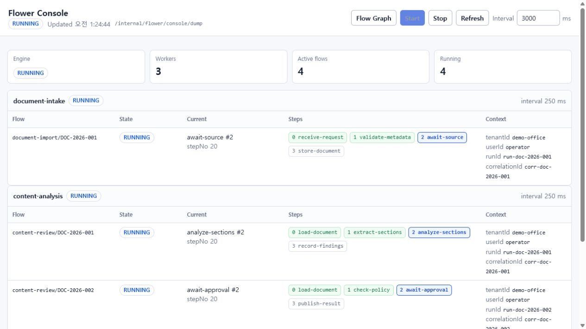

# Flower Runtime Reference

[English introduction](../README.md) | [한국어 소개](../README.ko.md)

This English reference retains the detailed integration and runtime guidance
previously included in the root README. Start with the
[self-contained quick start](../README.md#quick-start) for a runnable example.
Other application sketches use host-defined services, repositories, and events.

- [Installation and Java compatibility](#install-from-maven-central)
- [Kafka integration](#typical-use-with-kafka)
- [Operational boundaries](#operational-boundaries)
- [Execution model](#mental-model) and [Step lifecycle](#step-lifecycle)
- [Step IDs and shared state](#step-ids-stepno-and-shared-state)
- [Events and waits](#event-driven-steps)
- [Step design rules](#step-design-rules) and [submission](#flow-submission)
- [Execution context](#execution-context)
- [Bloom and event buses](#event-bus-choices)
- [Spring Boot configuration](#spring-boot)
- [Checkpoint / Resume](#checkpoint--resume)
- [Observability](#observability) and [console](#spring-boot-console)
- [Modules and maturity](#modules-and-maturity)
- [Testkit setup and recovery tests](#testing-with-flower-testkit)

## Install From Maven Central

Flower `0.1.3` is published to Maven Central under the
`io.github.flowerjvm` group. No custom repository or `mavenLocal()` is
required.

For a plain Java application, start with `flower-core`:

Gradle Kotlin DSL:

```kotlin
dependencies {
    implementation("io.github.flowerjvm:flower-core:0.1.3")
}
```

Maven:

```xml
<dependency>
    <groupId>io.github.flowerjvm</groupId>
    <artifactId>flower-core</artifactId>
    <version>0.1.3</version>
</dependency>
```

For Spring Boot applications, use the starter instead:

```kotlin
dependencies {
    implementation("io.github.flowerjvm:flower-spring-boot-starter:0.1.3")
}
```

Add only the modules your application needs:

| Use case | Artifact |
| --- | --- |
| Core Flow / Worker runtime | `io.github.flowerjvm:flower-core:0.1.3` |
| Spring Boot auto-configuration | `io.github.flowerjvm:flower-spring-boot-starter:0.1.3` |
| JDBC checkpoints | `io.github.flowerjvm:flower-persistence-jdbc:0.1.3` |
| Logging, metrics, tracing, and dumps | `io.github.flowerjvm:flower-observability:0.1.3` |
| Offline datasets, experiments, and evaluators | `io.github.flowerjvm:flower-evaluation:0.1.3` |
| Deterministic test helpers | `io.github.flowerjvm:flower-testkit:0.1.3` |
| Event-driven execution | `io.github.flowerjvm:flower-eventloop:0.1.3` |
| Event-loop JDBC checkpoints | `io.github.flowerjvm:flower-eventloop-persistence-jdbc:0.1.3` |

See [Modules And Maturity](#modules-and-maturity) before adopting an MVP
module. The Bloom adapter is published separately as
`io.github.flowerjvm:bloom-flower-adapter:0.1.1`.

### Java compatibility

| Build or artifact | Minimum Java |
| --- | --- |
| `flower-core`, event-loop, persistence, observability, evaluation, testkit, and Flower Check artifacts | Java 8 |
| `flower-spring-boot-starter` | Java 17 and Spring Boot 3.x |
| Full Flower repository build | JDK 17 |

CI runs the Java 8-compatible modules on a Java 8 runtime and verifies the full
reactor on JDK 17 and 21. A Java 8/11 application can use the compatible
artifacts, but it cannot load the Spring Boot starter because that artifact is
compiled for Java 17.

Build-time Flower usage checks are available through the
[`flower-check-maven-plugin`](../flower-check-maven-plugin/README.md) and
[`flower-check-gradle-plugin`](../flower-check-gradle-plugin/README.md), both at
version `0.1.3`.

## Use Flower With ChatGPT And Codex

Install the [Flower plugin for ChatGPT and Codex](https://chatgpt.com/plugins/plugins_6a6b70b4903081918ec3eb37651cf01f).
Coding agents can build, verify, and maintain Flower workflows directly in
your Java project. The plugin includes guidance for Flower application
workflows and governed actions with Flower Action Runtime.

## Typical Use With Kafka

Flower works well when Kafka tells a Spring Boot service that something
happened and the service needs to advance an internal flow.

Kafka tells the application that something happened. Flower decides whether the
current step can move forward. The database remembers the business fact.

This example keeps Kafka concerns such as duplicate handling, inbox/outbox, and
startup recovery out of the main flow. Those belong in production code, not in
the first shape.

```java
@Component
final class OrderKafkaListener {
    private final Engine engine;
    private final OrderRepository orders;
    private final OrderFlowFactory flows;

    @KafkaListener(topics = "order-created")
    void onOrderCreated(OrderCreated event) {
        orders.markCreated(event.orderId());

        engine.worker("orders").submit(
                flows.createOrderFlow(event.orderId()),
                DuplicatePolicy.IGNORE);
    }

    @KafkaListener(topics = "payment-approved")
    void onPaymentApproved(PaymentApproved event) {
        orders.markPaymentApproved(event.orderId());
        engine.eventBus().publish(event);
    }
}

final class OrderFlowFactory {
    private final OrderRepository orders;

    OrderFlowFactory(OrderRepository orders) {
        this.orders = orders;
    }

    Flow createOrderFlow(String orderId) {
        return Flow.builder("order", orderId)
                .step("accept", new AcceptOrderStep())
                .step("payment", new WaitPaymentStep(orders))
                .step("complete", new CompleteOrderStep())
                .build();
    }
}

final class WaitPaymentStep extends Step {
    private final OrderRepository orders;

    WaitPaymentStep(OrderRepository orders) {
        this.orders = orders;
    }

    @Override
    protected void onEnter(StepContext ctx) {
        ctx.startTimeout(30_000);
        ctx.subscribe(PaymentApproved.class, event -> {
            if (event.orderId().equals(ctx.flowId().flowKey())) {
                ctx.signal("paid"); // event arrived; check the DB on the next tick
            }
        });
    }

    @Override
    protected StepResult onTick(StepContext ctx) {
        String orderId = ctx.flowId().flowKey();
        if (orders.isPaymentApproved(orderId)) {
            return StepResult.done();
        }
        if (ctx.timedOut()) {
            return StepResult.fail(new IllegalStateException("payment timeout"));
        }
        return StepResult.stay();
    }
}
```

The event handler does not complete the Step directly. It records a signal, and
the next `onTick` completes the Step by returning `StepResult.done()` after the
database says the payment is approved.

The split is simple:

```text
Kafka event  = something happened
Flower Step  = decide stay, done, or fail
Database     = remember the business fact
```

In a Spring multi-module application, Flower usually belongs in the workflow
module rather than the domain model itself:

```text
order-api       REST/Kafka input
order-domain    Order, OrderStatus, repository, domain service
order-workflow  Flower FlowFactory and Step classes
order-events    Kafka event DTOs, publisher, listener
order-infra     DB, Kafka, Flower engine config
```

The Kafka listener stays thin: persist the domain fact, publish the event to
Flower's in-JVM event bus, and let the Step decide whether the flow can advance.

### Production Notes For Kafka

Keep the boundaries boring on purpose:

- Kafka carries domain events.
- Flower keeps the internal execution position.
- The DB keeps business facts and recovery state.
- Flower signals are hints, not business facts.
- Use an inbox or event id check for duplicate Kafka events when needed.
- Use an outbox for external events or commands that must be published
  reliably.
- On startup, recover or submit flows for DB records that are still active but
  not currently running.

## Operational Boundaries

Flower core is deliberately small, so its runtime contract is also explicit:

- Concurrency: a Worker ticks its Flows on one scheduler thread. Submit/cancel
  requests are queued. Event callbacks may call `ctx.signal(...)`; do not mutate
  Step fields directly from callback threads.
- Recovery: durable Flows checkpoint the current step id, `stepNo`, execution
  context, and definition version. Recovery rebuilds a fresh Flow and resumes
  from that checkpoint. It is not deterministic replay or exactly-once side
  effect execution, so external writes and API calls should be idempotent.
- Durable event-loop effects have explicit crash windows. An `await(...).thenRun`
  or `thenPublish` effect runs after the await checkpoint, so a process failure
  in between can leave the saved wait without having dispatched the effect.
  Effects attached to `next`, `goTo`, `finish`, or `fail` run before the next or
  terminal checkpoint, so a recovered application may repeat them. Important
  external work needs a durable intent/outbox or operation record with a stable
  idempotency key; Flower does not make either ordering exactly-once.
- Scale: the default Worker is tick-based and simple to test. It is a good fit
  for small to medium in-process workloads. Very large numbers of idle Flows may
  need application-level sharding or a different Worker scheduling strategy.
  Possible scheduling optimizations are tracked in [ROADMAP.md](../ROADMAP.md).

## Mental Model

```text
Engine
  -> Worker
      -> Flow
          -> Step
              -> StepResult
              -> stepNo
```

- `Engine`: top-level runtime. Owns `Clock`, `EventBus`, `Worker`s, and
  listeners.
- `Worker`: single-threaded tick loop. Owns active flows and ticks each
  non-terminal flow once per worker tick.
- `Flow`: one ordered sequence of steps for one domain instance, identified by
  `FlowId(flowType, flowKey)`.
- `Step`: a small stateful orchestration unit. It receives a `StepContext` and
  returns `StepResult`.
- `StepResult`: the explicit transition returned by a Step.
- `stepId`: a stable flow-level string id used by `goTo`, dumps, checkpoints,
  and admin views.
- `stepNo`: optional step-local cursor for tiny sub-state inside one step.

## Structure For Generated Code

Flower core is not an AI framework, and it does not depend on an LLM. Its
relevance in the AI coding era is structure.

AI can generate more orchestration code than humans can comfortably review
when that code becomes scattered callbacks, service methods, scheduled jobs,
and background threads. Flower's contribution is to force that behavior into a
small, inspectable shape:

```text
Engine -> Worker -> Flow -> Step -> StepResult
```

Generated and hand-written orchestration both become easier to inspect, test,
recover, observe, and change. A step starts work, checks state, and returns an
explicit result, so a reviewer, tool, or coding agent can follow it.

`flower-check` is available as build-time tooling for host applications. It can
reject known Flower anti-patterns such as blocking a worker tick or hiding
orchestration outside the Flow / Step boundary. Longer-term developer tooling
ideas live in [ROADMAP.md](../ROADMAP.md); they are intentionally outside
`flower-core`.

## Step Lifecycle

```text
onEnter(ctx)       called once when the step becomes current
onTick(ctx)        called once per worker tick while the step is current
onExit(ctx)        cleanup when the current step exits, including cancellation
onReset(ctx)       called for StepResult.repeat(), then the step re-enters
```

`onTick` returns one of:

| Result | Meaning |
| --- | --- |
| `StepResult.stay()` | Keep this step and tick again later. |
| `StepResult.done()` | Finish this step and move to the next declared step, or finish the flow if this was the last step. |
| `StepResult.repeat()` | Reset this step and run it from the beginning. |
| `StepResult.goTo("stepId")` | Jump to another flow-level step id. |
| `StepResult.finish()` | Finish the flow successfully without running later steps. |
| `StepResult.fail(Throwable)` | Fail the flow. |

## Step IDs, stepNo, And Shared State

Flower already has step ids. They are flow-level string ids:

```java
Flow flow = Flow.builder("order", orderId)
        .step("accept", new AcceptOrderStep(orderService))
        .step("payment", new WaitForPaymentStep())
        .step("fulfill", new FulfillOrderStep(warehouseService))
        .build();

return StepResult.goTo("payment");
```

The core keeps step ids as strings because the same ids must be readable in
logs, dumps, checkpoints, admin screens, and external configuration. If you
want type safety in application code, wrap them with an enum:

```java
enum OrderStep {
    ACCEPT("accept"),
    PAYMENT("payment"),
    FULFILL("fulfill");

    private final String id;

    OrderStep(String id) {
        this.id = id;
    }

    String id() {
        return id;
    }
}
```

```java
Flow flow = Flow.builder("order", orderId)
        .step(OrderStep.ACCEPT.id(), new AcceptOrderStep(orderService))
        .step(OrderStep.PAYMENT.id(), new WaitForPaymentStep())
        .step(OrderStep.FULFILL.id(),
                new FulfillOrderStep(warehouseService))
        .build();
```

Use `stepNo` only as a small cursor inside one Step. If it starts representing
business states such as `WAITING_PAYMENT`, `RETRYING`, `FULFILLING`, or
`FAILED`, split the behavior into explicit Steps.

When multiple Steps need shared values, do not hide them in `stepNo` or
step-local signals. Use domain state, or pass a small run context object while
building the Flow:

```java
final class OrderFlowRun {
    final String orderId;
    PaymentResult paymentResult;
    FulfillmentPlan fulfillmentPlan;

    OrderFlowRun(String orderId) {
        this.orderId = orderId;
    }
}
```

```java
OrderFlowRun run = new OrderFlowRun(orderId);

Flow flow = Flow.builder("order", orderId)
        .step(OrderStep.ACCEPT.id(), new AcceptOrderStep(run, orderService))
        .step(OrderStep.PAYMENT.id(), new WaitForPaymentStep(run, paymentService))
        .step(OrderStep.FULFILL.id(),
                new FulfillOrderStep(run, warehouseService))
        .build();
```

For durable flows, keep recoverable business state in your domain storage. A
run context object is convenient for transient coordination, but it is not a
durable source of truth after process restart.

## Event-Driven Steps

Steps should be asynchronous in shape. Do not block a worker thread while
waiting for outside work. Start or subscribe in `onEnter`, return `stay()` while
waiting, return `done()` when the completion condition is met, and handle
timeouts with an explicit failure or recovery transition.

```java
final class WaitForPaymentStep extends Step {

    @Override
    protected void onEnter(StepContext ctx) {
        ctx.startTimeout(30_000);
        ctx.subscribe(PaymentApproved.class, event -> {
            if (event.orderId().equals(ctx.flowId().flowKey())) {
                ctx.signal("paid");
            }
        });
    }

    @Override
    protected StepResult onTick(StepContext ctx) {
        if (ctx.hasSignal("paid")) {
            return StepResult.done();
        }
        if (ctx.timedOut()) {
            return StepResult.fail(new IllegalStateException("payment timeout"));
        }
        return StepResult.stay();
    }
}
```

If `onTick` needs the event data, attach it to the signal. Flower keeps only
the latest payload for each signal name, which is usually what a waiting step
needs:

```java
ctx.subscribe(PaymentApproved.class, event -> ctx.signal("paid", event));

PaymentApproved approved = ctx.consumeSignal("paid", PaymentApproved.class);
if (approved != null) {
    return StepResult.done();
}
```

Subscriptions made through `StepContext.subscribe(...)` are cleaned up
automatically when the step exits, resets, or the flow terminates.

You may also unsubscribe a specific event while a step is still running. Keep
that pattern small. If the step starts to need its own large internal state
machine, split the behavior into multiple explicit Steps instead.

## Step Design Rules

- Keep `onTick` short and non-blocking. No `sleep`, long polling, network waits,
  or database loops inside the worker tick.
- Start external work in `onEnter`, then observe completion through events,
  signals, stored domain state, or timeouts.
- Use `StepContext.subscribe(...)` for step-owned event subscriptions so Flower
  can release them automatically.
- Use `StepContext.eventBus().publish(...)` when a step needs to emit an event.
- Use `stepNo` for small internal cursors, not for large hidden state machines.
  If the cursor turns into business state, split the Step.
- Put heavy domain logic in services. A step should orchestrate, not become the
  domain model.
- Pass dependencies through step constructors. Flower does not instantiate steps
  by reflection and does not provide a DI container in core.
- Give every step a stable, meaningful flow-level id. `goTo(...)` targets that
  id, not the Java class name. Wrap ids in an enum when application code needs
  type safety.
- Keep shared values in domain state or an explicit run context object. Durable
  flows must be recoverable from domain state and checkpoints, not from
  transient Step fields alone.
- Prefer immutable events and exact event classes. The default event buses match
  by exact runtime type.
- Treat a `Step` instance as owned by one `Flow`. Create fresh step instances
  when building a new flow.
- Use `Guard` for "do not enter this step yet" rules. Use `StepResult.stay()`
  for "I entered and am waiting" rules.
- Make terminal outcomes explicit. Return `done()` for success and
  `fail(cause)` for failure.

## Flow Submission

```java
Flow flow = Flow.builder("order", orderId)
        .step("accept", new AcceptOrderStep(orderService))
        .step("payment", new WaitForPaymentStep())
        .step("fulfill", new FulfillOrderStep(warehouseService))
        .build();

worker.submit(flow);
```

`flowType` and `flowKey` form the `FlowId`. Submitting a duplicate flow defaults
to `DuplicatePolicy.REJECT`. Within the same Worker, you can also use `IGNORE`
or `REPLACE`. The same FlowId cannot be active in another Worker of the same
Engine, regardless of that policy.

```java
worker.submit(flow, DuplicatePolicy.REPLACE);
```

## Execution Context

A `FlowId(flowType, flowKey)` answers "which domain instance is this flow for?"
`ExecutionContext` answers "whose execution is this?"

Use it when logs, dumps, checkpoints, admin views, or future audit/eval tooling
need to connect one flow run to a tenant, user, session, run id, trace id, or
correlation id.

Existing code does not need to change. Flows default to
`ExecutionContext.empty()`.

```java
import io.github.flowerjvm.flower.core.context.ExecutionContext;

ExecutionContext execution = ExecutionContext.builder()
        .tenantId("office-a")
        .userId("user-1")
        .sessionId("session-1")
        .runId("run-123")
        .traceId("trace-abc")
        .correlationId("request-789")
        .build();

Flow flow = Flow.builder("order", "ORD-1")
        .executionContext(execution)
        .step("accept", new AcceptOrderStep(orderService))
        .step("payment", new WaitForPaymentStep())
        .build();
```

Steps can read it when they need execution identity:

```java
String tenantId = ctx.executionContext().tenantId().orElse("default");
String runId = ctx.executionContext().runId().orElse("unknown");
```

Keep this context small. It is an execution id card, not a business context.
Do not put roles, permissions, approval state, domain objects, agent ids,
action ids, or policy decisions in Flower core context. Keep that state in the
host application's own runtime or in a higher-level integration layer.

`ExecutionContext` is attached to the `Flow`, not to a `ThreadLocal`. That keeps
the same identity visible from steps, listeners, dumps, checkpoints, and
recovery even when events or callbacks happen on other threads.

Important: `tenantId` does not change Flower's duplicate-flow identity.
`FlowId(flowType, flowKey)` is unique across Workers within one Engine. If
two tenants can have the same domain key, make the `flowKey` globally unique in
the host application, for example `office-a:DOC-1`.

## Event Bus Choices

`flower-core` includes `InMemoryEventBus` for simple setups and deterministic
tests. Bloom is the small in-memory event bus provided in the Flower ecosystem.
To share events with Bloom, use Bloom's optional `bloom-flower-adapter` module:

```java
EventBus bloom = LocalEventBus.create();

Engine engine = Engine.builder()
        .eventBus(BloomEventBus.wrap(bloom))
        .worker(Worker.builder("main").build())
        .build();
```

The adapter preserves the dispatch semantics of the wrapped Bloom bus.
The adapter is owned by the Bloom repository so Flower's default build remains
independent of Bloom.

### Bloom Event Example

When Flower is backed by Bloom, application code can publish to Bloom directly.
Flower steps subscribed through `ctx.subscribe(...)` will receive the same
events.

```java
EventBus bloom = LocalEventBus.create();

Engine engine = Engine.builder()
        .eventBus(BloomEventBus.wrap(bloom))
        .worker(Worker.builder("orders").intervalMillis(100).build())
        .build();
```

Application code publishes an ordinary Bloom event:

```java
final class PaymentService {
    private final EventBus bloom;
    private final OrderRepository orders;

    PaymentService(EventBus bloom, OrderRepository orders) {
        this.bloom = bloom;
        this.orders = orders;
    }

    void approvePayment(String orderId) {
        orders.markPaymentApproved(orderId); // business fact
        bloom.publish(new PaymentApproved(orderId)); // wake waiting steps
    }
}
```

The waiting Flower step receives that Bloom event through the adapter:

```java
final class WaitPaymentStep extends Step {
    private final OrderRepository orders;

    WaitPaymentStep(OrderRepository orders) {
        this.orders = orders;
    }

    @Override
    protected void onEnter(StepContext ctx) {
        ctx.startTimeout(30_000);
        ctx.subscribe(PaymentApproved.class, event -> {
            if (event.orderId().equals(ctx.flowId().flowKey())) {
                ctx.signal("payment-approved");
            }
        });
    }

    @Override
    protected StepResult onTick(StepContext ctx) {
        if (orders.isPaymentApproved(ctx.flowId().flowKey())) {
            return StepResult.done();
        }
        if (ctx.timedOut()) {
            return StepResult.fail(new IllegalStateException("payment timeout"));
        }
        return StepResult.stay();
    }
}
```

In this setup Bloom remains the application event bus, while Flower uses the
same events to advance the internal flow. The signal is only a wake-up hint; the
database remains the source of truth.

## Spring Boot

`flower-spring-boot-starter` auto-configures:

- a `Clock` bean, defaulting to `SystemClock.INSTANCE`
- an `EventBus` bean, defaulting to `InMemoryEventBus`
- a `FlowCheckpointStore`, when JDBC persistence is explicitly enabled
- an `Engine` bean
- a lifecycle bean that starts and stops the engine with the application context

Example configuration:

```yaml
flower:
  enabled: true
  auto-start: true
  persistence:
    type: none
  workers:
    - name: orders
      interval-ms: 100
    - name: alerts
      interval-ms: 250
```

Provide your own `Engine`, `EventBus`, `Clock`, or `FlowerListener` beans when
you need more control. The auto-configuration backs off where appropriate.

For durable flows with JDBC checkpoints, add `flower-persistence-jdbc`, create
the table using the packaged schema SQL, and enable the store explicitly:

```yaml
flower:
  persistence:
    type: jdbc
    jdbc:
      dialect: postgresql
      initialize-schema: never
```

Supported dialects are `postgresql`, `mysql`, `oracle`, `h2`, and `sqlite`. The starter
does not create tables automatically; `initialize-schema` is reserved and
currently only supports `never`. If you need a custom backend, provide a
`FlowCheckpointStore` bean and the auto-configured `Engine` will use it.

## Checkpoint / Resume

Flower's durable mode is checkpoint/resume, not durable execution replay.
It stores only the current Flow position so an application can rebuild a fresh
Flow and resume ticking from that position.

```java
Flow flow = Flow.builder("order", orderId)
        .durable()
        .durableStep("payment", new WaitPaymentStep(orderService),
                RecoveryPolicy.REENTER_IDEMPOTENT)
        .durableStep("fulfill", new FulfillOrderStep(warehouseService),
                RecoveryPolicy.REENTER_IDEMPOTENT)
        .build();
```

Durable flows require every step to declare a recovery policy. A regular
`Step` may opt in through `durableStep(...)` with
`RecoveryPolicy.REENTER_IDEMPOTENT` when re-running `onEnter` is safe. If
initial entry and recovery setup must be different, extend `DurableStep` with
`RecoveryPolicy.RESUME_ONLY` and implement `onResume(ctx)`.

```java
Flow recovered = Flow.builder("order", orderId)
        .durable()
        .durableStep("payment", new WaitPaymentStep(orderService),
                RecoveryPolicy.REENTER_IDEMPOTENT)
        .durableStep("fulfill", new FulfillOrderStep(warehouseService),
                RecoveryPolicy.REENTER_IDEMPOTENT)
        .build()
        .recoverFrom(checkpoint);
```

Applications that want a small startup helper can register factories by
`flowType` and recover the checkpoints they choose:

```java
FlowFactoryRegistry registry = FlowFactoryRegistry.builder()
        .register("order", id -> buildOrderFlow(id.flowKey()))
        .build();

FlowRecoveryService recovery = FlowRecoveryService.create(store, registry);
recovery.recoverActiveForWorker(engine.worker("orders"));
```

The helper only rebuilds fresh Flows and submits them to the chosen Worker. It
does not start Workers, create schema, lock rows, delete failed checkpoints, or
turn Flower into an event replay engine.

Core exposes `FlowCheckpointStore` as the storage boundary. The default store
is no-op, so existing transient flows are unaffected. Durable Flows require a
store that declares durable capability; the no-op store is rejected. Core does not create DB
tables. JDBC, Redis, JPA, or file-backed checkpoint stores should live in
optional modules or in the host application, and schema initialization should
be explicit and opt-in.

Durable checkpoints keep the `ExecutionContext` with the saved flow position.
After recovery, the same logical run keeps the same `runId`, `traceId`, tenant,
and user identifiers. Flower does not regenerate a new run id during recovery.

Core `StepContext.startTimeout(...)` is a runtime-only helper and is not stored
in durable checkpoints. Durable Flows reject it so a restart cannot silently
reset or lose a deadline. For durable waits, store `dueAtMillis` or equivalent
deadline data in domain state, or use the event-loop runtime's await deadlines.

`flower-persistence-jdbc` provides a JDBC implementation:

```java
FlowCheckpointStore store = JdbcFlowCheckpointStore.create(
        dataSource,
        JdbcCheckpointDialects.postgresql());

Engine engine = Engine.builder()
        .eventBus(InMemoryEventBus.create())
        .worker(Worker.builder("orders").build())
        .checkpointStore(store)
        .build();
```

`flower-eventloop-persistence-jdbc` provides a separate JDBC implementation for
event-loop checkpoints. Schema SQL is packaged for PostgreSQL, MySQL, Oracle,
H2, and SQLite. Apply the SQL yourself, or copy it into Flyway/Liquibase. The
JDBC stores do not create tables automatically.

SQLite support is aimed at embedded desktop and agent applications that ship a
local database file. The host supplies the SQLite JDBC driver and may use the
same `DataSource` for its own tables and both Flower checkpoint stores. See
[Persistence](../docs/persistence.md) for the SQLite dialect, schema paths, and
single-process operating guidance.

For dialect paths, execution-context columns, and migration notes, see
[Persistence](../docs/persistence.md).

Signals are still in-memory wake-up hints. Durable step decisions should be
based on domain state that can be checked again after restart, not on signal
payloads alone.

Operational boundaries to remember:

- Flow ownership is enforced inside one `Engine`, not across JVMs. If multiple
  processes recover from the same checkpoint store, the application must
  coordinate recovery with its own lock, lease, or leader election.
- Checkpoint `save(...)` and `delete(...)` run synchronously on the Worker tick
  path or EventWorker loop path. Slow storage slows Flow progress.
- Terminal durable Flows save a terminal tombstone before cleanup delete, so
  normal completion may perform both a save and a delete.
- `definitionVersion` is checked only when both the Flow and checkpoint have a
  non-null version.

## Observability

Attach `FlowerListener` implementations to observe flow submission, step
entry/exit, flow completion, cancellation, failure, listener errors, and worker
errors. `Engine.dump()` gives a snapshot of the current engine and worker
state, including active flows, current step id, current step index, current
stepNo, and the declared step list for admin/console views.

The `0.1.2` runtime also emits payload-light `FlowerTraceEvent`
records to opt-in `FlowerTraceListener` implementations. Unlike the older
coarse lifecycle callbacks, these events include per-runtime sequence numbers,
distinct `stepRunId` values for repeated Step attempts, effective transition
outcomes, event-loop wait/resume reasons, and durable checkpoint/recovery
facts. Existing `FlowerListener` implementations remain unchanged and do not
pay Trace allocation cost.

`flower-observability` provides `FlowerTraceSinkListener`, in-memory and
composite sinks, `AsyncFlowerTraceSink`, `OpenTelemetryFlowerTraceSink`, and an
append-only `JsonLinesFlowerTraceSink`. Storage and security adapters include
fail-closed `TraceSanitizer`, deterministic trace-level sampling, explicit
content capture policy, and a local content-addressed artifact store.

For cross-project traces, `FlowerObservationEvent` is the common envelope and
`FlowerObservationSink` is the shared destination. `FlowerTraceObservationSink`
maps Core Flow events into it; separate Agent, AI Harness, and Action Runtime
modules map their native lifecycle events without adding those domain types to
Flower Core.

Keep fast sanitization and sampling on the listener path, then hand selected
events to the bounded asynchronous sink before file, artifact, database, HTTP,
OpenTelemetry, or messaging I/O:

```text
Worker -> sanitize -> sample -> bounded async queue -> content/artifact -> storage
```

Flower Core never captures prompts, Tool results, business payloads, or API
keys. Higher layers must opt in to content capture and configure their own
sanitization policy. Monitor each sink's drop/failure counters; trace
backpressure never stops business Flow execution.

[Flower Studio](https://github.com/flowerjvm/flower-studio) is the read-only
local consumer for this correlated stream. It
can open common observation JSON Lines or legacy Core trace JSON Lines and show
Trace outcomes, nested runs, event timing, Step transitions, waits, recovery,
and optional Agent, Harness, Tool, approval, and Action overlays. It also reads
`flower-evaluation` result and feedback streams to show candidate quality,
cases, scores, baseline regressions, and Trace references. Its Monitoring view
adds bounded Trace outcomes, operation failure/duration, Step-transition,
activity, source, token, approval, and evaluation-quality aggregates. It can
also overlay a selected Core Flow run on an optional static
`flower.flow-graph/v4` snapshot, keeping declared structure, observed paths,
version mismatches, and runtime-only transitions visibly distinct. These views
describe the currently loaded local files; production metrics and alerts remain
the job of Micrometer/OpenTelemetry and the host observability platform. See the
[Flower Studio repository](https://github.com/flowerjvm/flower-studio) for the
included runnable demo and its local-reference operating boundary.

`flower-evaluation` supplies versioned Dataset, Example, Candidate, Experiment,
Evaluator, Score, and Feedback contracts, deterministic rules, failure-isolated
offline execution, baseline comparison, and local JSON Lines reference stores.
It evaluates completed behavior; it does not replace AI Harness validation,
Agent loops, or Action Runtime authorization. See the
[Flower Evaluation README](../flower-evaluation/README.md).

See [Tracing, Studio, And Evaluation Architecture](../docs/tracing-studio-evaluation.md)
for the event contract and phased Studio/evaluation plan, and
[Trace Storage And Security](../docs/tracing-storage-security.md) for the reference
pipeline and operating boundaries. [Domain Observation Adapters](../docs/domain-observation-adapters.md)
shows how Flow, Agent, Harness, and Action events share one correlated stream.

Lifecycle listener snapshots stay lightweight. The declared step list is only
materialized for dump/admin views so observability does not add work to every
listener callback.

### Spring Boot Dump Endpoint

`flower-spring-boot-starter` can expose a read-only Engine dump endpoint when
the application is already a Spring MVC web application. It is disabled by
default because dump output can include flow keys, execution context, and
operational state.

```yaml
flower:
  admin:
    dump:
      enabled: true
      path: /internal/flower/dump
      pretty: false
```

With the default path, the endpoint is:

```text
GET /internal/flower/dump
GET /internal/flower/dump?pretty=true
```

The endpoint uses the host application's web server. Flower does not start a
separate console server. In production, keep this endpoint behind application
authentication, a private network, VPN, or an admin gateway.

### Spring Boot Console

For a small built-in web view, enable the console endpoint:

```yaml
flower:
  admin:
    console:
      enabled: true
      path: /internal/flower/console
      api-path: /internal/flower/console/dump
      poll-interval-ms: 3000
      flow-graph-url: http://localhost:8790/
```

Then open:

```text
GET /internal/flower/console
```

The console is served by the same Spring Boot application and polls the
same-origin `api-path`. It shows Engine, Worker, Flow, current Step, stepNo,
declared Step order, and execution context. The UI has Start, Stop, Refresh,
and polling interval controls. Its `Flow Graph` button opens the configured
read-only local source graph in a new tab. The Console itself does not analyze
or serve source code. Use the optional development-only graph starter to manage
the loopback server with the Spring lifecycle, or run the Maven plugin or CLI
separately. Set `flow-graph-url` to an empty string to hide the button.

Example runtime view:



To start the local graph with a Spring Boot development profile, add the
separate Flower Flow Graph starter:

```xml
<dependency>
  <groupId>io.github.flowerjvm</groupId>
  <artifactId>flower-flow-graph-spring-boot-starter</artifactId>
  <version>0.1.0</version>
  <scope>runtime</scope>
</dependency>
```

```yaml
flower:
  flow-graph:
    enabled: true
    project-root: .
    port: 8790
```

The graph starter is disabled by default and binds only to the loopback
interface. Omit it or leave it disabled in production.

This is an internal/admin surface, not a public endpoint. Do not expose it
directly to the internet.

## Modules And Maturity

`flower-core` provides the established `Worker → Flow → Step → StepResult`
execution contract. Core development focuses on preserving that model and
compatibility with existing application code. Optional modules and ecosystem
projects develop around this foundation.

Core:

- `flower-core`: stable center. Engine, Worker, Flow, Step, event bus, clock,
  and listener APIs.

Persistence / integration:

- `flower-persistence-jdbc`: JDBC `FlowCheckpointStore` plus schema SQL for
  PostgreSQL, MySQL, Oracle, H2, and SQLite.
- `flower-spring-boot-starter`: Spring Boot auto-configuration for an `Engine`
  and optional checkpoint store wiring.

Bloom integration:

- `bloom-flower-adapter`: maintained in the Bloom repository; adapts Bloom's
  event bus to Flower's `EventBus` SPI.

Observability / testing:

- `flower-observability`: listeners and helpers for logging, dumps, metrics,
  tracing, and awaiting flow completion.
- [`flower-studio`](https://github.com/flowerjvm/flower-studio) (separate
  project): read-only local JSON Lines Trace, Run, and event explorer with
  optional artifact links, evaluation views, execution graphs, and a bounded
  monitoring dashboard.
- `flower-evaluation` (MVP): post-run datasets, experiments, evaluators,
  baseline regression comparison, feedback, and local JSON Lines stores.
- `flower-testkit` (MVP): deterministic Flow test helpers.

Developer tooling:

- `flower-check` (MVP): build-time Flower usage checker for host applications.
- `flower-check-annotations` (MVP): SOURCE-retained approval markers consumed
  by `flower-check`.
- `flower-check-maven-plugin` (MVP): Maven `verify` integration for
  `flower-check`.
- `flower-check-gradle-plugin` (MVP): companion Gradle plugin project for
  running `flower-check` from Gradle `check`.

Early execution line:

- `flower-eventloop` (MVP): separate event-driven runtime for explicit waits
  such as callbacks, signals, approvals, LLM/tool responses, and deadlines.
- `flower-eventloop-persistence-jdbc` (MVP): JDBC `EventFlowCheckpointStore`
  plus event-loop schema SQL.

MVP labels apply to the individual optional components listed above, whose
APIs are still being refined. The event loop is a separate
execution line, not a replacement for the tick-driven Worker / Flow / Step
model. Work that is not shipped in this repository is tracked in
[ROADMAP.md](../ROADMAP.md).

## Testing With Flower Testkit

`flower-testkit` keeps testing helpers outside `flower-core`. It does not
change the runtime model; it only bundles the setup most tests repeat:

```text
Engine + Worker + ManualClock + InMemoryEventBus
+ RecordingFlowerListener + FakeCheckpointStore
```

Add it as a test dependency:

```xml
<dependency>
    <groupId>io.github.flowerjvm</groupId>
    <artifactId>flower-testkit</artifactId>
    <version>0.1.3</version>
    <scope>test</scope>
</dependency>
```

Example:

```java
FlowTestHarness harness = FlowTestHarness.create();

Flow flow = Flow.builder("order", "ORD-1")
        .executionContext(TestExecutionContexts.tenantRun("office-a", "run-1"))
        .step("accept", new AcceptOrderStep(orderService))
        .step("payment", new WaitForPaymentStep())
        .build();

harness.submit(flow)
        .tick() // Complete accept and select payment.
        .tick() // Enter payment and subscribe before publishing the event.
        .assertFlow("order", "ORD-1")
        .isRunning()
        .currentStepIs("payment")
        .tenantIdIs("office-a")
        .runIdIs("run-1");

harness.publish(new PaymentApproved("ORD-1"))
        .tick()
        .assertFlow("order", "ORD-1")
        .isFinished();
```

For durable Flow recovery tests, reuse the same fake checkpoint store through
`restart()` and recover with a `FlowFactoryRegistry`:

```java
FlowTestHarness restarted = harness.restart();

int recovered = restarted.recoverActiveCount(registry);

restarted.tick()
        .assertFlow("order", "ORD-1")
        .currentStepIs("payment")
        .runIdIs("run-1");
```

The first version intentionally avoids a large assertion DSL or a JUnit-only
API. Failed `FlowAssertions` checks throw `AssertionError`, so the helpers work
with JUnit, AssertJ, or plain test code.
